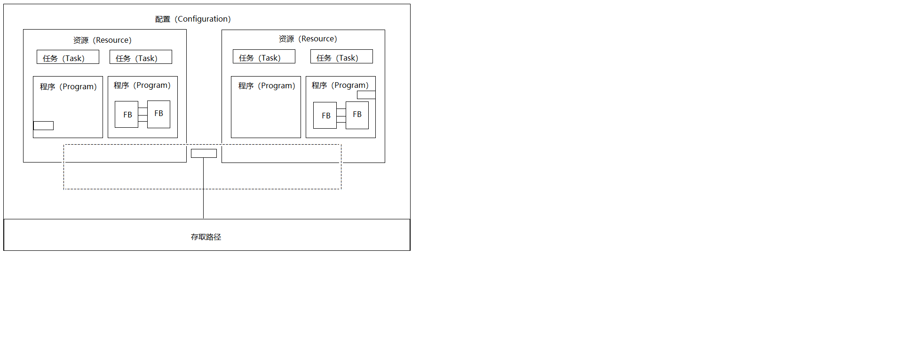
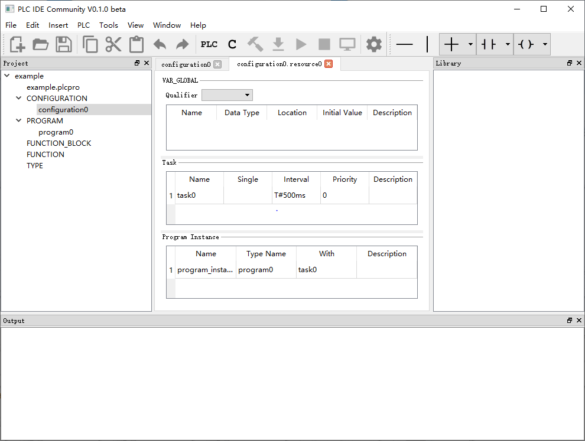
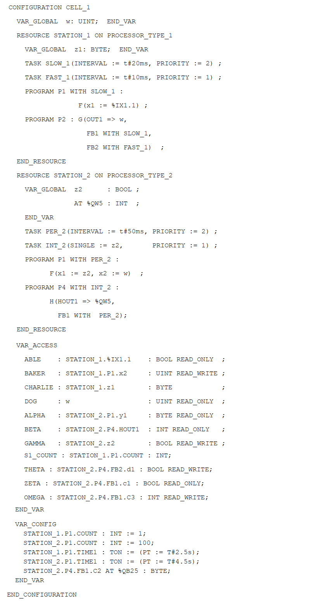
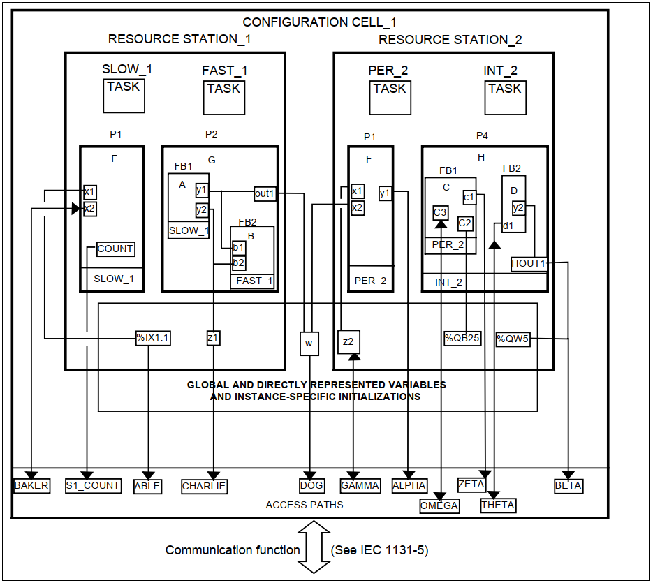
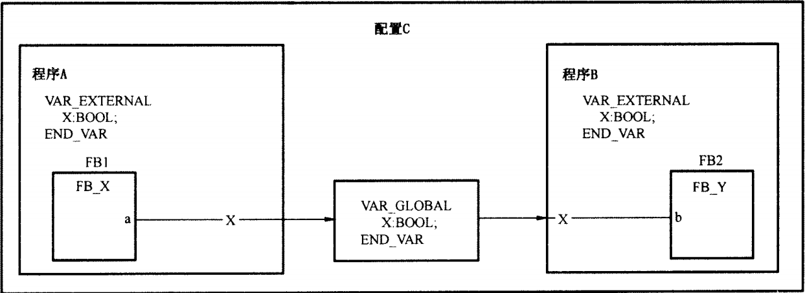
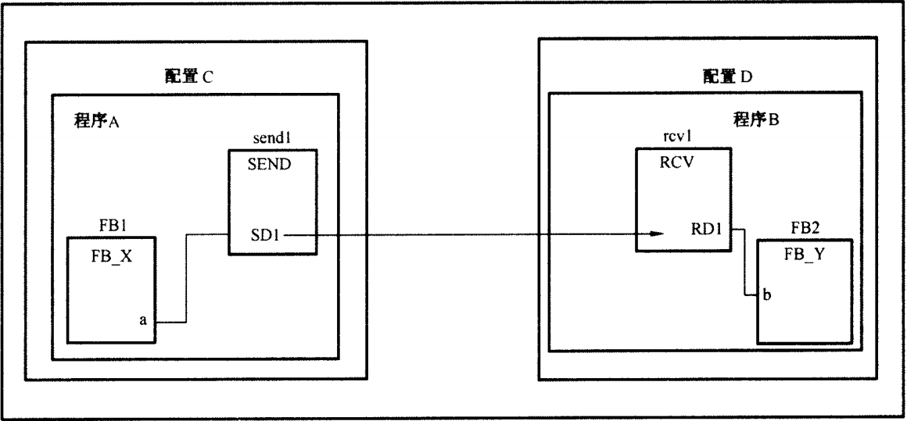
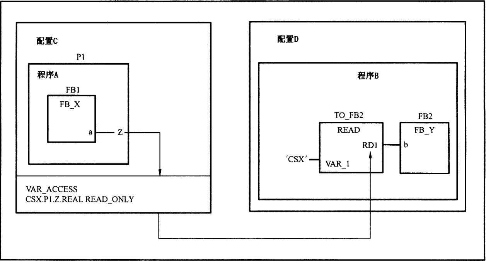
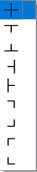

IEC61131-3标准可编程逻辑控制器编程参考手册
========================================

# 修订历史

版本 |	日期 | 修订人 |	审核人 | 描述 
:-: | :-: | :-: | :-: | :-
V0.1 |	2020.2.21 |	冯洲 | 冯洲 | 初次创建，部分功能还未实现，以实际为准。
 
# 前言
本编程参考手册归纳总结了《中华人民共和国国家标准GB/T 15969.3——2005/IEC 61131-3:2002 可编程序控制器 第3部分：编程语言》的各项规定、要求与限制，使用户能准确把握标准的精髓，快速上手，完成PLC应用程序编写与系统组态。
GB/T 15969.3标准等同翻译IEC 61131-3标准，下文统一称为IEC 61131-3标准，或简称为标准。
 
#1	软件模型
IEC 61131-3标准的软件模型用分层结构表示，每一层隐含其下层的许多特性，从而构成优于传统可编程控制器软件的理论基础。软件模型描述基本的高级软件元素及其相互关系，是现代PLC的软件基础。这些元素包括：
- 程序组织单元，即程序、功能块和功能
- 组态元素，即配置、资源、任务、全局变量和存取路径

IEC61131-3标准的软件模型如图所示： 

IEC 61131-3标准软件模型从理论上描述了如何将一个复杂程序分解为若干小的可管理部分，并在各分解部分之间有清晰和规范的接口方法。另外，软件模型还描述一台可编程控制器如何实现多个独立程序的同时装载和运行，如何实现对程序执行的完全控制等。
以下各节将按从上至下的顺序依次介绍软件模型中不同层级的元素的定义及作用。
##1.1	配置
配置（Configuration）位于软件模型的最上层，是可编程控制器系统的整个软件，用于定义特定应用的PLC系统的特性。对于大型复杂的应用，如整个产品线的自动化，可能需要几个PLC相互作用，一个配置可以与其它IEC配置通过通信接口实现通信。在这种情况下，每个PLC的软件可作为一个分离的配置。因此，可将配置认为是一个特定类型的控制系统，它包括硬件装置、处理资源、I/O通道的存储地址和系统能力，即等同于一个PLC的应用程序。
配置用关键字CONFIGURATION开始，随后是配置名称和配置声明，最后用关键字END_CONFIGURATION结束。配置声明包括定义该配置的有关类型和全局变量的声明、在配置内资源的声明、存取路径变量的声明和实例专用初始化变量声明等。
在PLC集成开发环境中，配置采用一个专门的页面进行管理，不需要手写代码，这种方式更直观，也更方便。下图为配置管理页面：

在PLC系统中，配置将系统内的所有资源结合成组，在一个配置中，可定义在该PLC项目中全局有效使用的全局变量，作为资源之间数据交换的手段。

##1.2	资源
资源（Resource）位于软件模型的第二层，它为运行程序提供支持系统，是能执行IEC程序的处理手段。资源反映了可编程控制器的物理结构，为程序和PLC的物理输入输出通道提供了一个接口。
每个配置内可有一个或多个资源。资源提供对所有程序执行所需特性的支持。
一个程序只有在资源中实例化才能运行。资源的主要功能之一是提供程序和PLC物理I/O通道之间的界面。
每个资源可支持多于一个的程序。因此，资源使PLC能够加载、启动和执行许多总体独立的程序。
资源有资源名称，它被分配在一个PLC的CPU中。因此，可将资源理解为一个PLC中的微处理器单元。资源内定义的全局变量在该资源内部是有效的。资源可调用具有输入输出参数的运行期程序，给一个资源分配任务和程序，并声明直接表示变量。
资源用关键字RESOURCE开始，随后是资源名称和ON关键字、资源类型名和资源声明，最后用END_RESOURCE关键字结束。
资源名是一个符号名，它用于说明可编程控制器系统中的一个处理器。编程系统提供可编程控制器系统内该资源（即每个CPU的命名）的类型和数量，并检验这些资源类型和数量，使系统能够正确地使用这些资源。
资源声明包括在该资源内的全局变量、任务和程序声明等内容。在资源声明段中，ON关键字指定特定的处理器类型，每种处理器具有限定的“信号处理功能”、“人机接口”和“传感器和执行机构接口”。
在PLC集成开发环境中，资源采用一个专门的页面进行管理，如下图所示：


##1.3	任务
任务（Task）位于软件模型分层结构的第3层。任务用于规定程序组织单元（POU）在运行期的特性。任务是一个执行控制元素，它具有调用能力。
一个资源中可以有多个用户任务。一旦任务被设置，它就可控制一系列程序组织单元周期地执行，或者根据一个特定的事件触发来执行。
每个资源都有一个最低优先级（比所有声明的用户任务更低）的默认任务，不需要用户声明。如果声明的程序实例没有与任何任务结合，则自动与默认任务结合。
任务由关键字TASK开始，随后是任务名、任务初始化设置（用圆括号将任务的有关参数分列其中）。
###1.3.1	任务初始化设置
任务初始化设置有三个参数：
- SIGNAL：触发任务执行的事件输入端，在该事件触发信号的上升沿，触发任务执行一次；
- INTERVAL：任务周期执行的时间间隔。当其值不为零，且SIGNAL信号保持为0，则表示该任务被周期执行；
- PRIORITY：任务优先级，0表示最高优先级，优先级越低，数值越高。

例如：
```
TASK   slow_1  (INTERVAL  :=  T#20ms, PRIORITY  :=  2);
```
表示任务名为slow_1的任务是周期执行的任务，周期间隔时间20ms，优先级为2。
在资源管理页面使用表格化方式对任务进行设置，上述slow_1任务表示如下：


###1.3.2	任务执行准则
- 单任务输入SIGNAL不为零，表示该任务在SIGNAL上升沿时触发执行一次，是事件触发的单任务；
- 当INTERVAL不为零，SIGNAL保持为零，则该任务周期执行，执行周期由INTERVAL数据确定；
- 当多个任务执行时，立即中断正在执行的任务，使优先级高的任务先被执行；
- 如果多个任务的优先级相同，则按时间片轮转执行；
- 没有与任何任务结合的程序实例，默认结合至默认的最低优先级任务，在资源开始运行时立即开始执行，且执行完毕后立即重新启动。

##1.4	程序实例
一个程序只有在资源内部实例化后才能被调用。
程序实例化以PROGRAM关键字开始，随后是程序名，如果程序实例与特定任务结合，使用WITH关键字声明，最后是程序实例名及程序接口。例如：
```
PROGRAM  P1  WITH  slow_1 : F(x1 := %IX1.1);
```
其中，P1是程序名，与slow_1任务结合，程序实例名为F，程序接口为实例传递实参数据。
在资源管理页面使用表格化方式对程序实例进行设置，上述程序实例F表示如下：


##1.5	全局变量
标准允许变量在不同的软件元素中被声明。变量的范围确定其在哪个程序组织单元中是可用的。范围可能是局部的或全局的。每个变量的范围由它被声明的位置和声明所使用的关键字所定义。
在配置中声明的全局变量可在整个配置范围内使用，在资源中声明的全局变量只能在该资源范围内使用。全局变量的声明格式如下：
```
VAR_GLOBAL
	全局变量说明
END_VAR
```

全局变量能与其它网络进行数据交换。一个系统中不能有相同名称的两个全局变量。在每个使用全局变量的程序组织单元中，需要用VAR_EXTERNAL关键字来声明它。全局变量提供了在两个不同程序和功能块之间非常灵活的交换数据的方法。
##1.6	存取路径
存取路径用于将全局变量、直接表示变量和功能块的输入、输出和内部变量联系起来，实现信息的存取。它提供在不同配置之间交换数据和信息的方法。每一配置内的许多指定名称的变量可通过其他远程配置来存取。
有两种存取方法：读写方法和只读方法。读写（READ_WRITE）方式表示通信服务能够改变变量的值；只读（READ_ONLY）方式表示能够读取变量的值但不能改变变量的值。当不规定存取路径方法时，约定的存取方式是只读方式。
存取路径变量声明的方法：
```
VAR_ACCESS
	存取路径名：外部存取路径：存取路径变量的数据类型和读写属性
END_VAR
```
外部存取路径采用串联方式表示。开始是资源名，然后是程序实例名，功能块实例名，最后是变量名。各名称之间用圆点分隔，中间没有的名称可以省略。
##1.7	实例专用的初始化
等待补充……
##1.8	示例
软件模型的代码示例:

对应图形示例：

#2	编程模型
标准规定的PLC编程语言元素包括：
- 数据类型
- 变量
- 程序组织单元（功能、功能块、程序）
- 顺序功能图（SFC）元素
- 配置元素（全局变量、资源、存取路径、任务）

这些语言元素的组合应遵守以下规则：
- 导出数据类型应使用标准数据类型和先前导出的任何数据类型进行说明。
- 导出功能使用标准或导出数据类型、标准功能和先前导出的任何功能进行说明。该说明应使用为IL、ST、LD或FBD语言定义的机制。
- 导出功能块使用标准或导出数据类型和功能、标准功能块和先前导出的任何功能块进行说明。该说明应使用为IL、ST、LD或FBD语言定义的机制，并可包括顺序功能图（SFC）元素。
- 程序使用标准或导出数据类型、功能和功能块进行说明。该说明应使用为IL、ST、LD或FBD语言定义的机制，并可包括顺序功能图（SFC）元素。
- 使用全局变量、资源、任务和存取路径等元素，可将程序组合进配置。
 


#3	通信模型
IEC 61131-3标准定义了变量在不同层级的软件元素间通信的各种方法。
##3.1	程序内通信
在一个程序内的变量可以直接通信，只要将一个程序元素的输出连接到另一个程序元素的输入即可。如下图所示：
 

##3.2	通过全局变量进行通信
在同一个配置中的程序间，变量可以通过全局变量进行通信。如下图所示： 


##3.3	通过通信控制块通信
两个配置间、一个程序中不同部分之间或者PLC程序与非PLC系统之间可以使用GB/T 15969.5中定义的标准通信功能块，如下图所示： 


##3.4	通过存取路径通信
使用GB/T 15969.5定义的机制，PLC或非PLC系统可以通过存取路径传输可提供的数据。 


#4	印刷字符的使用
根据国家标准GB/T 15969.3-2005，可编程控制器使用的文本和图形类编程语言中的文本元素应根据国家标准GB 1988字符集的“基本代码表”的3-7列的字符组成，并根据GB 2312-1980《信息交换用汉字编码字符集 基本集》来表示汉字。
支持小写字母时，字母的大小写不作区分，即control与CONTROL、Control具有相同的意义。
汉字只允许出现在注释与附注中，即不参与编写程序逻辑。
##4.1	引用字符集


##4.2	标识符
标识符必须由字母、数字和下划线字符组成，标识符用于表示在IEC语言中的不同元素，包括变量、标号和函数、功能块、程序组织单元等名称。使用标识符的规则如下：
- 标识符的第1个字符必须为字母或下划线；
- 标识符中的大小写字母具有相同的意义；
- 标识符中不允许有两个或两个以上连续的下划线；
- 标识符的结尾不能用下划线；
- 标识符至少应支持6个不同的字符，最大字符数与实现有关；

##4.3	分界符

分界符|应用场合|备注和示例
:-: | :-: | :-
空格|允许在PLC程序中插入空格	
(* *)|	注释起始、结束符号|不允许嵌套注释
{ }|	附注起始、结束符号|
+|十进制数字的前缀符号<br/>加操作符号<br/>交叉连接点|<br/><br/>图形编程语言中表示交叉连接点
-|十进制数字的前缀符号<br/>减操作符号<br/>年-月-日的分隔符<br/>水平线|<br/><br/><br/>图形编程语言中表示水平连接线
\#|基底数的分隔符<br/>数据类型分隔符<br/>时间文字的分隔符|	2#1111_1111或16#FF<br/>SINT#234, INT#16000, BOOL#0<br/>T#16ms, TOD#05:30:35.28
.|整数与小数的分隔符<br/>分级寻址分隔符<br/>结构元素分隔符<br/>功能块结构分隔符|3.14<br/>%IW2.5.7.1<br/>MOD_5_CONFIG.CHANNEL[5].RANGE<br/>TMR_1.Q, SR_103.S1
e或E|实指数分界符|1.0e+6, 1.2345E6
‘|单字节字符串开始与结束符号|‘hello world’
“|双字节字符串开始与结束符号|“你好，世界”
\$|字符串中特殊字符的开始|‘\$L’表示换行<br/>’\$R’表示回车<br/>’\$P’表示换页等
:|日时分隔符<br/>类型名称/规范分隔符<br/>变量/类型分隔符<br/>步名称终止符<br/>资源名称/类型分隔符<br/>程序名称/类型分隔符<br/>存取名称/路径/类型分隔符<br/>	指令标号终止符<br/>网络标号终止符|	
:=|初始化操作符<br/>输入连接操作符<br/>赋值操作符|
( )|枚举表分界符<br/>子范围分界符<br/>多重初始化<br/>指令表修改符、操作符<br/>功能变元<br/>子表达式分级<br/>功能块输入表分界符	
[ ]|数组下标分界符<br/>串长度分界符|
,|枚举表分隔符<br/>初始值分隔符<br/>数组下标分隔符<br/>被说明变量分隔符<br/>功能块初始值分隔符<br/>功能块输入表分隔符<br/>操作数表分隔符<br/>功能变元表分隔符<br/>CASE值表分隔符
;|类型说明分隔符<br/>语句分隔符
..|子范围分隔符<br/>CASE范围分隔符
%|直接表示前缀	
=>|输出连接操作符	
\||垂直线	

##4.4	关键字
表格 4 3关键字说明和示例
关键字 | 说明 | 示例
:-: | :-: | :-
CONFIGURATION<br/>END_CONFIGURATION|
RESOURCE<br/>END_RESOURCE|
TASK|
PROGRAM<br/>WITH|
PROGRAM<br/>END_PROGRAM|
FUNCTION<br/>END_FUNCTION|
FUNCTION_BLOCK<br/>END_FUNCTION_BLOCK|
VAR<br/>END_VAR|
VAR_INPUT<br/>END_VAR|
VAR_OUTPUT<br/>END_VAR|
VAR_IN_OUT<br/>END_VAR|
VAR_GLOBAL<br/>END_VAR|
VAR_EXTERNAL<br/>END_VAR|
VAR_ACCESS<br/>END_VAR|
VAR_TEMP<br/>END_VAR|
VAR_CONFIG<br/>END_VAR|
RETAIN|
NON_RETAIN|
CONSTANT|
ARRAY<br/>OF|
AT|
EN|
ENO|
TRUE|
FALSE|
TYPE<br/>END_TYPE|
STRUCT<br/>END_STRUCT|
IF<br/>THEN<br/>ELSIF<br/>ELSE<br/>END_IF|
CASE<br/>OF<br/>ELSE<br/>END_CASE|
REPEAT<br/>UNTIL<br/>END_REPEAT|
WHILE<br/>DO<br/>END_WHILE|
RETURN|
OTTO|
STEP<br/>END_STEP|
INITIAL_STEP<br/>END_STEP|
TRANSITION<br/>FROM<br/>TO<br/>END_TRANSITION|
ACTION<br/>END_ACTION|
R_EDGE|
F_EDGE|
READ_WRITE|
READ_ONLY|
BOOL<br/>BYTE<br/>WORD<br/>DWORD<br/>LWORD<br/>SINT<br/>INT<br/>DINT<br/>LINT<br/>USINT<br/>UINT<br/>UDINT<br/>ULINT<br/>REAL<br/>LREAL<br/>TIME<br/>DATE<br/>TIME_OF_DAY/TOD<br/>DATE_AND_TIME/DT<br/>STRING<br/>WSTRING|基本数据类型名称	
ANY<br/>ANY_DERIVED<br/>ANY_MAGNITUDE<br/>ANY_NUM<br/>ANY_INT<br/>ANY_REAL<br/>ANY_BIT<br/>ANY_STRING<br/>ANY_DATE|类属数据类型名称
||标准功能名称
||标准功能块名称
LD/LDN<br/>ST/STN<br/>S<br/>R<br/>AND/ANDN<br/>OR/ORN<br/>XOR/XORN<br/>NOT<br/>ADD<br/>SUB<br/>MUL<br/>DIV<br/>MOD<br/>GT<br/>GE<br/>EQ<br/>NE<br/>LE<br/>LT<br/>JMP/JMPC/JMPN<br/>CAL/CALC/CALN<br/>RET/RETC/RETN|指令表语言(IL)中的文本操作符	
||结构化文本语言(ST)中的文本操作符	

##4.5	空格的使用
空格定义为十进制数编码为32的SPACE字符以及如tab、newline等非打印字符。
标准规定在PLC文本的任何地方，应允许用户插入一个或多个空格，但在关键字、直接量、枚举值、标识符、直接表示变量，或在分界符组合内除外。

##4.6	注释
用户注释应分别在开头和结尾由特殊字符组合”(*”和”*)”来定界。在程序中允许使用空格的地方都应允许加入注释，但在字符串直接量内除外。注释没有语法或语义的意义。
不允许嵌套注释。

##4.7	附注
附注应分别在开头和结尾由花括号”{*”和”*}”来定界。在程序中允许使用空格的地方都应允许加入附注，但在字符串直接量内除外。附注没有语法或语义的意义。
不允许嵌套附注。

#5	数据的外部表示
在各种PLC语言中，数据的外部表示由数字直接量、字符串和时间直接量组成。所谓直接量，即为平常所说的常量。

##5.1	数字直接量
数字直接量包括整数直接量和实数直接量，被定义为十进制数或基底数。插在数字直接量数字间的单下划线字符’_’是没有意义的，不允许有连续的两个下划线字符，且下划线不能出现在头尾。
十进制直接量以字符0~9组成的字符串表示，实数直接量以小数点的存在来区分。一个指数表示是十的整数幂乘以前面的数以获得所表示的值。十进制直接量及其指数可以包含一个前置符（+或-）。
整数直接量也可以2、8、16为基底表示。基底数就为十进制符号。对于基底是16的整数直接量，应使用由数字0~9以及字母A~F组成的一组扩展数字表示。基底数不应包含前置符（+或-）。
布尔数据应分别具有值0或1的整数直接量或关键字“FALSE”或“TRUE”来表示。
布尔或数字直接量的数据类型通过在直接量前加类型前缀来规定，该类型前缀由基本数据类型名和符号’#’组成。
数字直接量的特性和举例如下表所示：
序号|特性描述|举例
:-:|:-:|:-
1|整数直接量|-12<br/>0<br/>123_456<br/>+986
2|实数直接量|-12.0<br/>0.0<br/>0.4560<br/>3.14159_26
3|带指数的实数直接量|-1.34E-12或-1.34e-12<br/>1.0E+6或1.0e+6<br/>1.234E6或1.234e6
4|基底为2的直接量|2#1111_1111（十进制255）<br/>2#1110_0000（十进制240）
5|基底为8的直接量|8#377（十进制255）<br/>8#340（十进制240）
6|基底为16的直接量|16#FF或16#ff（十进制255）<br/>16#ED或16#ed（十进制240）
7|布尔0<br/>布尔1|0<br/>1
8|布尔FALSE<br/>布尔TRUE|FALSE<br/>TRUE
9|类型化的直接量|DINT#5（5的DINT表示）<br/>UINT#16#9AF（十六进制值9AF的UINT表示）<br/>BOOL#0<br/>BOOL#1<br/>BOOL#TRUE<br/>BOOL#FALSE

##5.2	字符串直接量
字符串直接量包括单字节或双字节编码的字符串。
单字节字符串直接量以单引号’作为分界符，其中保存单字节字符。
双字节字符串直接量以双引号”作为分界符，其中保存双字节字符。
‘\$’提供字符转义操作，如下表所示：
组合|打印时的解释
:-:|:-
\$\$|美元符号
\$’|单引号
\$”|双引号
\$L或\$l|换行
\$N或\$n|新行
\$P或\$p|换页
\$R或\$r|回车
\$T或\$t|制表

字符串直接量特性如下表所示。
单字节字符串示例|双字节字符串示例|说明
:-:|:-:|:-
‘’|“”|长度为0的空串
‘A’|“A”|单字符A的长度为1的字符串
‘ ‘|“ “|空格字符的长度为1的字符串
‘\$’’|“’”|含单引号的长度为1的字符串
‘”’|“\$””|含双引号的长度为1的字符串
‘\$R\$L’|“\$R\$L”|含CR（回车）和LF（换行）的长度为2的字符串
‘\$\$5.00’|“\$\$5.00”|打印为\$5.00的长度为5的字符串
STRING#’OK’|WSTRING#”OK”|字符为OK的长度为2的字符串
‘AE’<br/>‘\$C4\$CB’|“AE”<br/>“\$00C4\$00CB”|长度为2的字符串，C4和CB是字符A和E的ASCII码

##5.3	时间直接量
时间直接量用于表示时间，可以是持续的时间、一天中的时刻、日期、日期和时刻。

#6	数据类型
IEC61131-3标准支持的数据类型分为基本数据类型、类属数据类型和导出数据类型三类。数据类型与它在数据存储器中所占用的数据宽度有关。
##6.1	基本数据类型
数据类型|关键字|位数（N）|允许取值范围|约定初始值
:-:|:-:|:-:|:-:|:-:
布尔|BOOL|1|0或1|0
8位长度的位串|BYTE|8|0 ~ 16#FF|16#00
16位长度的位串|WORD|16|0 ~ 16#FFFF|16#0000
32位长度的位串|DWORD|32|0 ~ 16#FFFF_FFFF|16#0000_0000
64位长度的位串|LWORD|64|0 ~ 16#FFFF_FFFF_FFFF_FFFF|16#0000_0000_0000_0000
短整数|SINT|8|-128 ~ 127|0
整数|INT|16|-32768 ~ 32767|0
双整数|DINT|32|-231 ~ 231 – 1|0
长整数|LINT|64|-263 ~ 263 - 1|0
无符号短整数|USINT|8|0 ~ +255|0
无符号整数|UINT|16|0 ~ +65535|0
无符号双整数|UDINT|32|0 ~ +232 - 1|0
无符号长整数|ULINT|64|0 ~ +264 - 1|0
实数|REAL|32|按SJ/Z9071对单精度浮点数的取值范围|0.0
长实数|LREAL|64|按SJ/Z9071对双精度浮点数的取值范围|0.0
持续时间|T<br/>TIME|||T#0
日期|D<br/>DATE|||D#0001-01-01
时刻|TOD<br/>TIME_OF_DAY|||TOD#00:00:00
日期和时刻|DT<br/>DATE_AND_TIME|||DT#0001-01-01-00:00:00
单字节字符串|STRING	|||‘’空单字节字符串
双字节字符串|WSTRING|||“”空双字节字符串

##6.2	类属数据类型
等待补充……

##6.3	导出数据类型
等待补充……

#7	变量
与数据的外部表示（即直接量或称常量）相比，变量提供一种识别其内容可以更改的数据对象的方法，如与PLC的输入、输出或存储器相关的数据。一个变量可以被说明为基本数据类型之一或导出数据类型之一。

##7.1	变量的表示
变量分为单元素变量和多元素变量两种。
单元素变量是以下类型的变量：
- 基本数据类型之一的单数据元素
- 导出枚举类型或子范围类型的元素
- 递归定义的导出数据类型，其“父”类型可追溯到基本类型、枚举类型或子范围类型的元素

单元素变量可以用标识符表示，或在PLC的输入、输出或存储器结构中用物理或逻辑位置直接表示，前者称为符号变量，后者称为直接表示变量。
多元素变量包括导出数据类型中的数组数据类型的变量和结构数据类型的变量。
###7.1.1	直接表示变量
直接表示变量又称直接变量，以百分数符号’%’开始，随后是位置前缀符号和大小前缀符号。如果有分级，则用无符号整数表示分级，并用小数点符号’.’分隔，最大级数由实现决定。
直接表示变量位置前缀符号的定义与特性如下表所示：
前缀符号|定义
:-:|:-:
I|输入单元位置	
Q|输出单元位置	
M|存储器单元位置	

直接表示变量大小前缀的定义与特性如下表所示：
前缀符号|定义|默认数据类型
:-:|:-:|:-:
无|单个位|BOOL
X|单个位|BOOL
B|8位字节|BYTE
W|16位字|WORD
D|32位双字|DWORD
L|64位长字|LWORD
*|表示还未确定位置的内部变量

直接表示变量示例:
示例|说明
:-:|:-
%IX1.3或%I1.3|表示输入单元1的第3位
%IW4|表示输入字单元4（即输入单元8和9）
%QX75和%Q75|表示输出位75
%MD48|表示双字，位于存储器48
%Q*|表示输出在一个未指定的位置
%IW2.3.4.5|多级表示的输入，表示PLC系统第2块I/O总线的第3个机架上的第4模块的第5通道（字）输入

###7.1.2	符号变量
符号变量是用符号表示的变量，其地址对不同的可编程控制器可以不同，从而为程序的移植创造了条件。例如：
```
VAR_INPUT  
SW_1  AT  %IX1.1 : BOOL; 
END_VAR
```
在上述变量声明中，用符号变量SW_1表示从%IX1.1地址读取布尔值，当实际地址更改时，在程序的其他部分仍是该符号变量。因此，只需对该地址进行修改，就可完成整个程序的移植，实现程序的重复使用。AT是定位前缀关键字。

###7.1.3	数组变量
等待补充……

###7.1.4	结构变量
等待补充……

##7.2	变量分类及属性
IEC61131-3标准根据应用范围对变量进行分类，通过设置变量属性将它们的有关性能赋予变量。变量分类如下表所示：
变量类型关键字|说明|外部读写|内部读写
:-:|:-:|:-:|:-:|
VAR|内部变量，程序组织单元内部的变量|不允许|读/写
VAR_INPUT|输入变量，由外部提供，在程序组织单元内部不能修改|读/写|读
VAR_OUTPUT|输出变量，由程序组织单元提供给外部实体使用|写|读/写
VAR_IN_OUT|输入-输出变量，由外部实体提供，能在程序组织单元内部修改|读/写|读/写
VAR_EXTERNAL|外部变量，能在程序组织单元内部修改，由全局变量组态VAR_GLOBAL提供|读/写|读/写
VAR_GLOBAL|全局变量，能在对应的配置、资源内使用|读/写|读/写
VAR_ACCESS|存取变量，用于与外部设备的不同程序间变量的传递|读/写|读/写
VAR_TEMP|暂存变量，在程序或功能块中暂时存储的变量|读/写|读/写
VAR_CONFIG|配置变量，实例规定的初始化和地址分配|不允许|读
变量附加属性如下表所示：
附加属性关键字|说明
:-:|:-
RETAIN|表示变量附加保持属性，即电源掉电时也能够保持该变量的值
NON_RETAIN|表示变量附加不保持属性，即电源掉电时不具有掉电保持功能
CONSTANT|表示该变量是一个常量，因此，程序执行时，该变量的值保持不变，不能修改
AT|表示变量存取的地址
R_EDGE|对输入变量设置上升沿边沿检测
F_EDGE|对输入变量设置下降沿边沿检测
READ_WRITE|对存取变量设置读写属性
READ_ONLY|对存取变量设置只读属性

##7.3	变量初始化
当配置元素（资源或配置）“启动”时，与配置元素及其程序有关的每个变量可以取以下初始值之一：
- 配置元素“停止”时，该变量具有的值（保持值）
- 用户规定的初始值；
- 变量的相关数据类型的缺省初始值；

变量的相关配置元素启动时，变量的初始值由下述规则确定：
- 如果启动操作为“暖启动”，则具有RETAIN属性的变量初始值为其保持值；
- 如果启动操作为“冷启动”，则具有RETAIN属性的变量初始值为用户规定的初始值，如果没有规定，则取相关数据类型的缺省初始值；
- 非保持变量的初始值为用户规定的初始值，如果没有规定，则取相关数据类型的缺省初始值；
- PLC系统输入的变量（处于I区的变量），初始值为0；
- PLC系统输出的变量（处于Q区的变量），初始值为0；
- PLC系统内部存储器的变量（处于M区的变量），初始值为0；

##7.4	变量声明
各种变量的声明及配置请参照《PLC集成开发环境用户手册》相关章节。

#8	程序组织单元
IEC61131-3定义的程序组织单元是功能、功能块和程序。它们是用户程序的最小软件单位。
程序组织单元不能够递归调用，即：一个程序组织单元的调用不应导致另一个相同类型的程序组织单元的调用。
程序组织单元的声明、参数定义和程序编写请参照《PLC集成开发环境用户手册》相关章节。

##8.1	功能
功能是一种可以赋予参数，但没有静态变量的程序组织单元，当用相同的输入参数调用一个功能时，该功能总是能够生成相同的输出结果。功能是可重复使用的软件元素，可以使用标准规定的各种编程语言编写。功能的重要特征是它们不能在内部存储数值，功能的调用结果可以作为表达式的一个操作数。
功能分为标准功能与用户定义功能两类。IEC61131-3标准定义了7类标准功能，分别是：
- 类型转换功能
- 数值运算功能
- 位串操作功能
- 选择与比较功能
- 字符串功能
- 时间数据类型的功能
- 枚举数据类型的功能

##8.2	功能块
功能块是在执行时能够产生一个或多个值的程序组织单元。在控制系统中，功能块实际是某种控制算法，例如PID功能被用于闭环控制，其它功能块可用于计数器、斜坡和滤波等。
功能块具有记忆功能，因此，相同输入参数调用时，其输出变量的值取决于其内部变量和外部变量的状态。与功能不同，功能块的内部变量是持续的。在两个采样时间间隔内，这些变量能够保持其值。功能块实例的记忆功能表现在下列两方面：
- 功能块实例的输入参数在下次调用前应保持不变；
- 功能块实例的输出参数在两次调用之间应保持不变；

功能块必须在程序组织单元（程序、其它功能块）的参数中声明为功能块实例才能被调用。
功能块分为标准功能块与用户定义功能块两类。标准功能块有：
- 双稳元素功能块
- 边沿检测功能块
- 计数器功能块
- 定时器功能块
- 通信功能块

##8.3	程序
程序是作为用户逻辑的调用入口的程序组织单元，程序的各种特性与功能块类似。
程序在资源说明中实例化，然后与特定任务结合起来，资源启动起来后，随着任务的调度，就会执行与之结合的程序实例，使用户逻辑运行起来。
##8.4	功能、功能块与程序的性能对比
性能|功能|功能块|程序
:-:|:-:|:-:|:-:
允许使用VAR|是|是|是
允许使用VAR_INPUT|是|是|是
允许使用VAR_OUTPUT|否|是|是
允许使用VAR_IN_OUT|否|是|是
允许使用VAR_EXTERNAL|否|是|是
允许使用VAR_GLOBAL|否|否|是
允许使用VAR_ACCESS|否|否|是
允许使用VAR_TEMP|否|是|是
允许使用VAR_CONFIG|否|否|是
功能值|是|否|否
可调用功能|是|是|是
可调用功能块|否|是|是
可调用程序|否|否|否
可递归调用|否|否|否
可间接功能块调用|否|是|是
具有过载和可扩展性|是|否|否
具有边沿检测的可能性|否|是|是
具有局部和输出变量的保持功能|否|是|是
可对直接表示变量声明|否|否|是
可对局部变量声明|是|是|是
可对功能块实例声明|否|是|是

#9	文本编程语言
IEC61131-3标准规定了两种文本语言：
- 指令表语言（Instruction List, IL），用一系列指令组成程序组织单元的本体部分。
- 结构化文本语言（Structured Text, ST），用一系列语句组成程序组织单元的本体部分。

##9.1	指令表（IL）
指令表由一系列指令组成，每条指令从新的一行开始，由操作符和操作数组成，操作符可带修改符，操作数如果多于一个，可用逗号分隔。指令也可带标号和注释。指令的格式如下：
```
标号:	操作符+修正符（可选）	操作数	(* 注释 *)
```
指令执行结果保存在一个称为“当前结果”的变量中，指令对“当前结果”进行相应操作，例如：
```
LD BOOL#1	(* 加载布尔值1至当前结果，执行后当前结果为BOOL#1 *)
AND BOOL#0	(* 将布尔值0与当前结果相与，执行后当前结果为 BOOL#0 *)
ST %MX0		(* 将当前结果值存入直接表示变量%MX0中，执行后%MX0 = BOOL#0，当前结果值不变 *)
```
大多数传统PLC都提供指令表编程语言。与传统PLC的指令表编程语言相比，IEC61131-3标准的指令表编程语言更为简单，因为采用了修正符、功能和功能块，一些原来用指令执行实现的操作可通过修正符、功能和功能块的调用方便地实现。而传统可编程控制器的操作指令很多，对不同的数据类型的同一类型运算要有不同的指令等。
指令表编程语言的主要特点是非常简单和容易学习，对于小型的简单过程控制问题是理想的编程语言。但对大型的复杂控制问题缺少有效工具，不太适用。

IEC61131-3标准将指令表编程语言的操作符简化为24种，下表列出所有支持的操作符和每个操作符允许使用的修正符。

操作符|修正符|操作数|说明|示例
:-:|:-:|:-:|:-:|:-:
LD|N|ANY|设置当前结果等于操作数|
ST|N|ANY|存储当前结果至操作数|
S||BOOL|如果当前结果是布尔1，则操作数置位为1|
R||BOOL|如果当前结果是布尔1，则操作数复位为0|
AND<br/>&|N, (|ANY|布尔逻辑与|
OR|N, (|ANY|布尔逻辑或|
XOR|N, (|ANY|布尔逻辑异或|
NOT||ANY_BIT|逻辑取反|
ADD|(|ANY|加|
SUB|(|ANY|减|
MUL|(|ANY|乘|
DIV|(|ANY|除|
MOD|(|ANY_INT|模除|
GT|(|ANY|比较：大于|
GE|(|ANY|比较：大于等于|
EQ|(|ANY|比较：等于|
NE|(|ANY|比较：不等于|
LE|(|ANY|比较：小于等于|
LT|(|ANY|比较：小于|
JMP|C, N|指令标号名称|跳转至标号|
CAL|C, N|功能块实例名称|调用功能块|
RET|C, N||从被调用的功能、功能块或程序返回|
)|||计算延缓操作，与(修正符配合使用|

修正符及其说明
修正符|说明
:-:|:-
C|仅当当前结果是布尔1时才执行相应指令<br/>如果与'N'修正符结合使用，表示仅当当前结果是布尔0时才执行相应指令
N|操作数按位取反
(|将操作符的求值递延至右括号操作符")"处。
指令带括号表达式的递延执行示例如下：
```
AND(
LD %IX1
OR %IX2
)
```
或更短的形式：
```
AND( %IX1
OR %IX2
)
```
###9.1.3 调用功能
有两种方式调用功能：
- 具有形式变元表的功能调用，例如：
```
LIMIT(
	EN := COND,
	IN := B,
	MN := 1,
	MX := 5,
	ENO => TEMPL
)
ST A
```
- 具有非形式变元表的功能调用，例如：
```
LD 1
LIMIT B,5
ST A
```

###9.1.4 调用功能块
有三种形式调用功能块：
- 具有非形式变元表的功能块调用，例如：
```
CAL C10(%IX0, FALSE, A, OUT, B)
CAL CMD_TMR(%IX5, T#300ms, OUT, ELASPED)
```
- 具有形式变元表的功能块调用，例如：
```
CAL C10(
	CU := %IX10,
	Q => OUT
)
CAL CMD_TMR(
	IN := %IX5,
	PT := T#300ms,
	Q => OUT,
	ET => ELAPSED,
	ENO => ERR
)
```
- 具有变元装载/存储的功能块调用，例如：
```
LD A
ADD 5
ST C10.PV
LD %IX10
ST C10.CU
CAL C10
```
上述举例中，假定程序组织单元中有如下说明：
```
VAR
	C10 : CTU;
	CMD_TMR : TON;
	A, B: INT;
	ELAPSED : TIME;
	OUT, ERR, TEMPL, COND : BOOL;
END_VAR
```

##9.2	结构化文本（ST）
结构化文本语言是高级编程语言，类似于PASCAL语言。它由一系列语句，例如：选择语句、循环语句、赋值语句等组成，用于实现一定功能。它不采用面向机器的操作符，而采用能描述复杂控制要求的功能性抽象语句，因此，具有清晰的程序结构，利于对程序的分析。它具有强有力的控制命令语句结构，使复杂控制问题变得容易解决。
###9.2.1	表达式
等待补充……

###9.2.2	语句
等待补充……

#10	图形编程语言
IEC61131-3标准规定了两种图形语言：
- 梯形图（Ladder Diagram, LD）
- 功能块图（Function Block Diagram, FBD）

##10.2	梯形图（LD）
梯形图编程语言是历史最久远的一种编程语言，源于电气系统的逻辑控制图，逻辑图采用继电器、触点、线圈和逻辑关系图等表示它们的逻辑关系。
IEC61131-3标准规定梯形图可采用的图形元素包括电源轨线、连接线、触点、线圈、功能和功能块。梯形图程序借助这些标准化的图形元素使PLC能够检测和修改数据。这些符号以类似于继电器梯形逻辑图的“梯级”方式在网络中布局，呈现在一张画布上。梯形图网络左右由两条电源轨线界定，中间由行列排布的大小相同的矩形图元组成。如下图所示：
 
如果一个元件的大小超出了一个图元的范围，则它将占用多个图元，比如功能与功能块实例调用。

###10.2.1 梯形图组成元件
- 左右电源轨线
梯形图左右分界的竖直线称为左右电源轨线，左电源轨线的状态始终为ON，右电源轨线的状态未定义，只作为梯形图网络统一的终止位置。

- 触点
触点元件用于表述布尔变量状态的变化 ，是向其右侧水平连接元素传递一个状态的梯形图元素。触点传递的状态是其左侧水平连接元素状态与触点关联布尔变量状态进行布尔与运算的结果。触点不改变关联变量的值。
按静态特性分类，触点分为常开触点和常闭触点。常开触点指在正常工况下，触点断开，其状态为0.常闭触点指在正常工况下，触点闭合，其状态为1。
按动态特性分类，触点分为正转换-检测触点和负转换-检测触点。
触点关联的变量名称直接标注在触点的上方。

触点类型|<div style="width: 100pt">符号|说明
:-:|:-:|:-
常开触点|\*\*\*<br/>-\| \|-|如果\*\*\*指示的相关布尔变量状态为ON，则左边连接的状态复制到右边连接，否则，右边连接的状态是OFF。
常闭触点|\*\*\*<br/>-\|/\|-|如果\*\*\*指示的相关布尔变量状态为OFF，则左边连接的状态复制到右边连接，否则，右边连接的状态是OFF。
正转换-检测触点|\*\*\*<br/>-\|P\|-|当触点左边水平连接状态为ON，此时检测到关联变量状态由OFF转变为ON，则从本次检测至下一次检测期间，触点右边水平连接状态为ON，其它时候为OFF。
负转换-检测触点|\*\*\*<br/>-\|N\|-|当触点左边水平连接状态为ON，此时检测到关联变量状态由ON转变为OFF，则从本次检测至下一次检测期间，触点右边水平连接状态为ON，其它时候为OFF。

- 线圈
线圈把其左边连接的状态无修改地复制到右边的连接，并把左边连接的状态或转换的适当功能存储到关联的布尔变量。

线圈类型|<div style="width: 100pt">符号|说明
:-:|:-:|:-
线圈|\*\*\*<br/>-( )-|左边连接的状态复制给关联布尔变量和右边连接
取反线圈|\*\*\*<br/>-(/)-|左边连接的状态复制给右边连接，其相反状态复制给关联的布尔变量
置位线圈|\*\*\*<br/>-(S)-|当左边连接处于ON状态，关联布尔变量被置位为ON，并保持该状态直到被复位线圈复位。
复位线圈|\*\*\*<br/>-(R)-|当左边连接处于ON状态，关联布尔变量被复位为OFF，并保持该状态直到被置位线圈置位
正转换-检测线圈|\*\*\*<br/>-(P)-|当检测到左边连接状态从OFF到ON的转换时，关联布尔变量从本次检测到下一次检测期间保持为ON，左边连接的状态总是被复制给右边连接。
负转换-检测线圈|\*\*\*<br/>-(N)-|当检测到左边连接状态从ON到OFF的转换时，关联布尔变量从本次检测到下一次检测期间保持为ON，左边连接的状态总是被复制给右边连接。

- 功能调用

- 功能块实例调用

- 连接线
梯形图各种元件由水平和竖直的线条进行连接，水平连接线和竖直连接线还会相交，构成各种样式的交叉连接线，如下图所示：


###10.2.2 梯形图网络求值顺序
梯形图按从上到下，从左到右的顺序进行求值。

##10.3	功能块图（FBD）
等待补充……

#11	顺序功能图（SFC）编程语言
等待补充……

