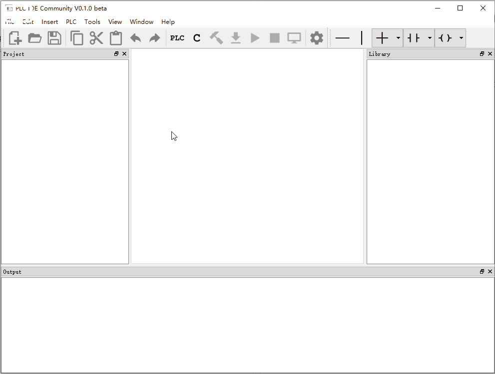
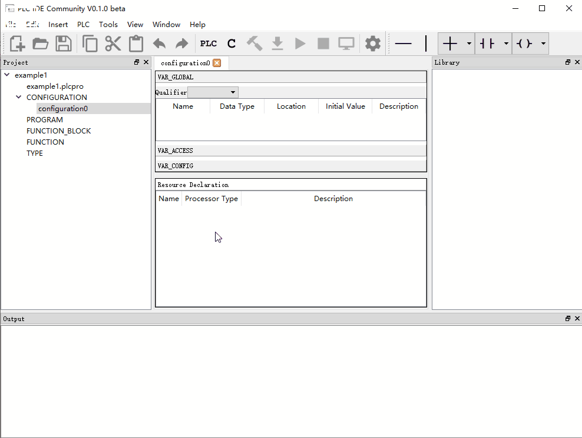
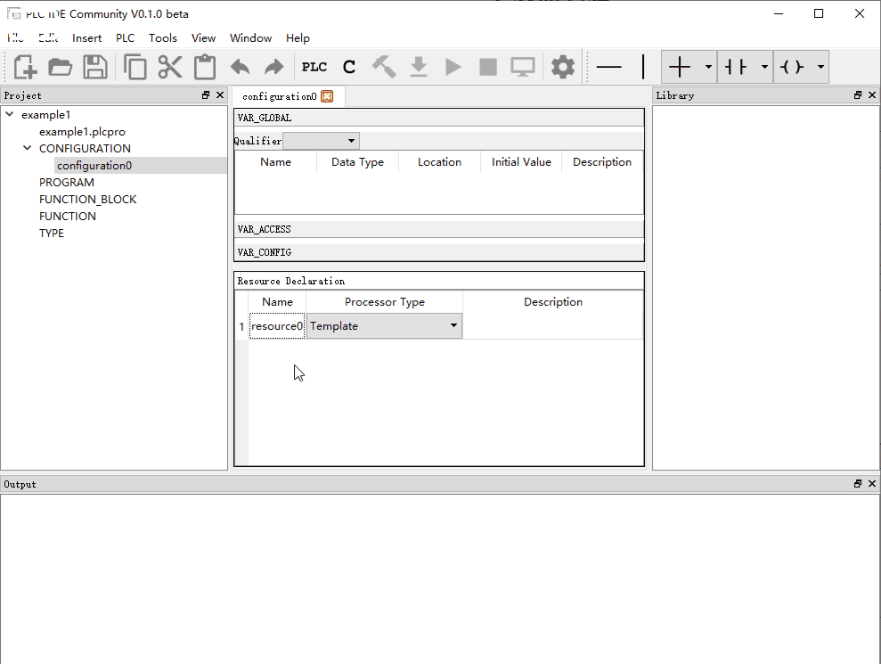
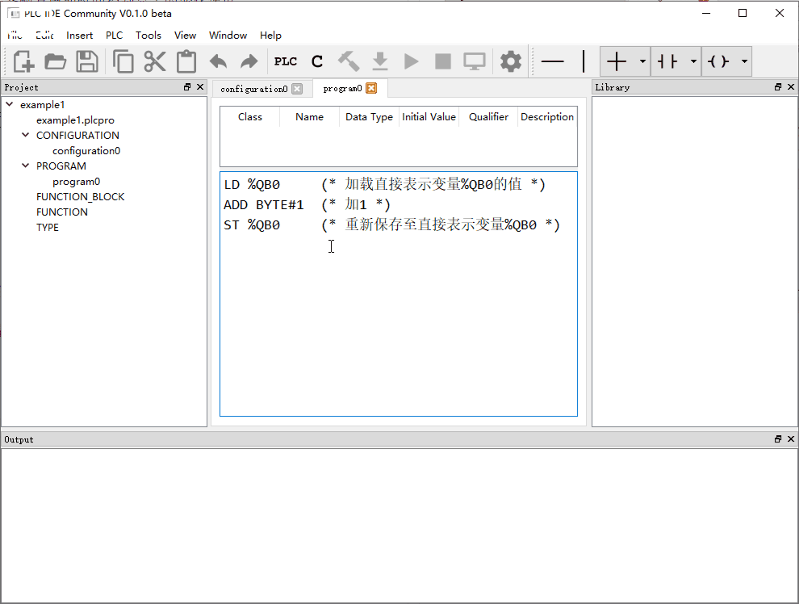
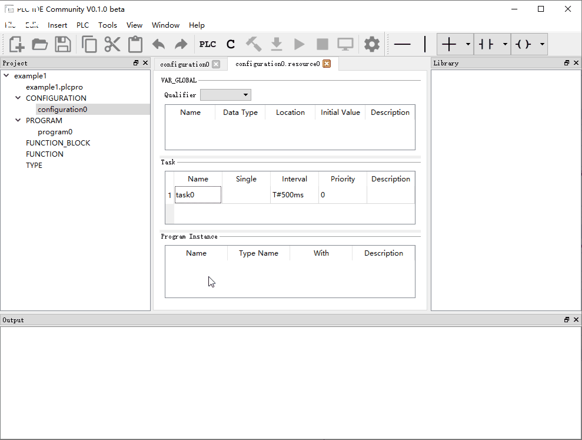
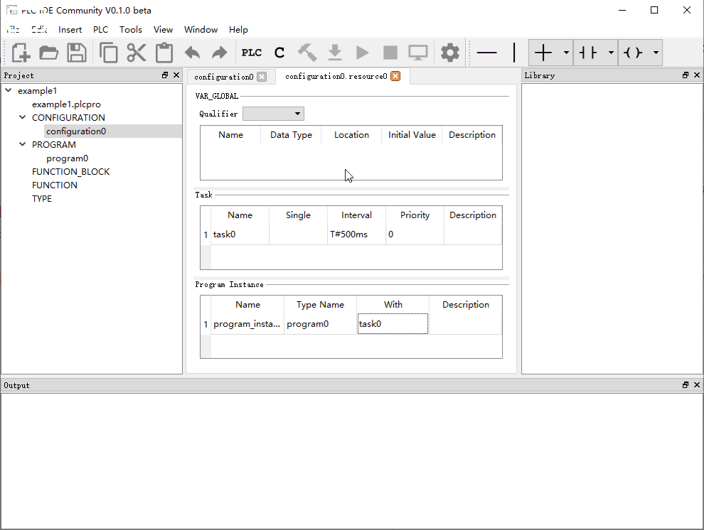

PLC集成开发环境（PLC IDE）使用示例
================================
 
## 示例一
本示例使用一块具有6路本地数字量输出的PLC开发板，采用指令表语言，实现六位二进制数的累加，以输出灯亮灭的形式显示出来，并通过调节任务触发周期时间控制显示的变化速度。

### 1.新建工程


### 2.添加资源

“Ctrl + S”快捷键保存。

### 3.新建程序
新建程序program0，编程语言选择IL语言。


### 4.使用IL语言编辑程序
在编辑窗体中输入以下代码：
```
LD %QB0     (* 加载直接表示变量%QB0的值 *)
ADD BYTE#1  (* 加1 *)
ST %QB0     (* 重新保存至直接表示变量%QB0 *)
```
“Ctrl + S”快捷键保存代码。

### 5.在资源中添加任务
添加任务task0，修改任务触发周期时间为500ms。

“Ctrl + S”快捷键保存。

### 6.在资源中添加程序program0的实例，并关联至任务task0

“Ctrl + S”快捷键保存。

### 7.将工程翻译并输出为C语言代码文件

生成完成后可在工程目录下的plctoc_output子目录下找到生成的代码：


### 8.复制生成的代码文件
将plctoc_output路径下的所有文件（不带目录结构）复制至RTT工程的plcapp目录


### 9.在rt-thread Studio中刷新RTT工程树，build生成目标代码并下载至目标板，查看运行效果
<iframe height=498 width=510 src='https://player.youku.com/embed/XNDYwMzAzNDA2MA==' frameborder=0 'allowfullscreen'></iframe>

视频链接：https://v.youku.com/v_show/id_XNDYwMzAzNDA2MA==.html

### 10.修改任务触发周期时间为100ms，重新生成代码并编译下载，查看效果
<iframe height=498 width=510 src='https://player.youku.com/embed/XNDYwMzAzMTQ2NA==' frameborder=0 'allowfullscreen'></iframe>

视频链接：https://v.youku.com/v_show/id_XNDYwMzAzMTQ2NA==.html
