PLC集成开发环境（PLC IDE）用户手册
========================================
 
# 修订历史

版本 |	日期 | 修订人 |	审核人 | 描述 
:-: | :-: | :-: | :-: | :-:
V0.1 |	2020.2.21 |	冯洲 | 冯洲 | 初次创建，部分软件功能还未实现，以实际为准。

#1	软件介绍
PLC IDE是一款符合IEC61131-3标准的通用PLC上位机编程软件，用户界面友好，操作简单方便。PLC IDE依照标准定义的PLC编程模型描述控制系统。可以将标准PLC语言编写的程序，转换为C语言程序输出。还可以结合PLC运行时内核代码直接编译出二进制的目标代码，实现编译型PLC功能。同时，软件还提供其它一些必备功能，比如程序下载、监控、调试等。
##1.1	软件特点
- 符合IEC61131-3标准，对应国标GB/T 15969-3；
- 支持标准编程模型：配置-资源-任务-程序-功能、功能块；
- 支持 IL（指令表）和 LD（梯形图）两种标准语言，未来会支持其它标准PLC编程语言，以及C语言、G代码等其它语言；
- 丰富的指令集，并支持 IEC61131-3 定义的标准功能与功能块；
- 可将PLC程序翻译为C语言程序输出；
- 可将PLC程序交叉编译为二进制目标代码，实现编译型PLC，相比解释型PLC，执行效率大大提高，指令密度更高，容错性更强（社区版软件不支持）；
- 显著降低PLC硬件成本，使用价格低廉、运算能力及存储空间有限的MCU就可实现完整的、高可靠性、高实时性的PLC功能，例如STM32F103RCT6；
- 良好的系统扩展性，不但支持单PLC控制，未来还将支持多PLC协同控制；
- 开放平台，支持添加新型号的PLC，有专门文档提供移植教程；
- 使用标准格式的文本保存PLC程序，便于程序复用与同行交流； 
- 支持多种编程接口：串口、SWD/JTAG；

#2	软件安装

按照安装包向导提示操作即可。

#3	软件运行目录说明

软件安装完成后，进入安装目录，可以看到该目录下包含如下内容（某些子目录及文件需要软件运行一次后才创建）：
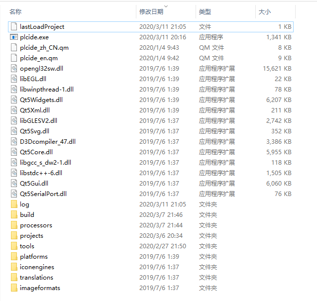

这些子目录与文件的作用分别是：
- build子目录：构建目标代码的中间目录
- log子目录：保存软件运行时输出的各种Log信息文件
- processors子目录：保存各种目标处理器相关工程、设置、代码文件
- projects子目录：保存用户创建的工程文件
- tools子目录：保存软件需要用到的各种第三方工具软件，比如build工具、交叉编译工具链等
- plcide_en.qm、plcide_zh_CN.qm：界面语言文件
- lastLoadProject：保存上次加载的工程路径文件名的文本文件
- plcide.exe：软件可执行文件
- 其它目录及*.dll文件：软件依赖的各种动态链接库文件
#4	软件界面
软件主界面截图如下：
 

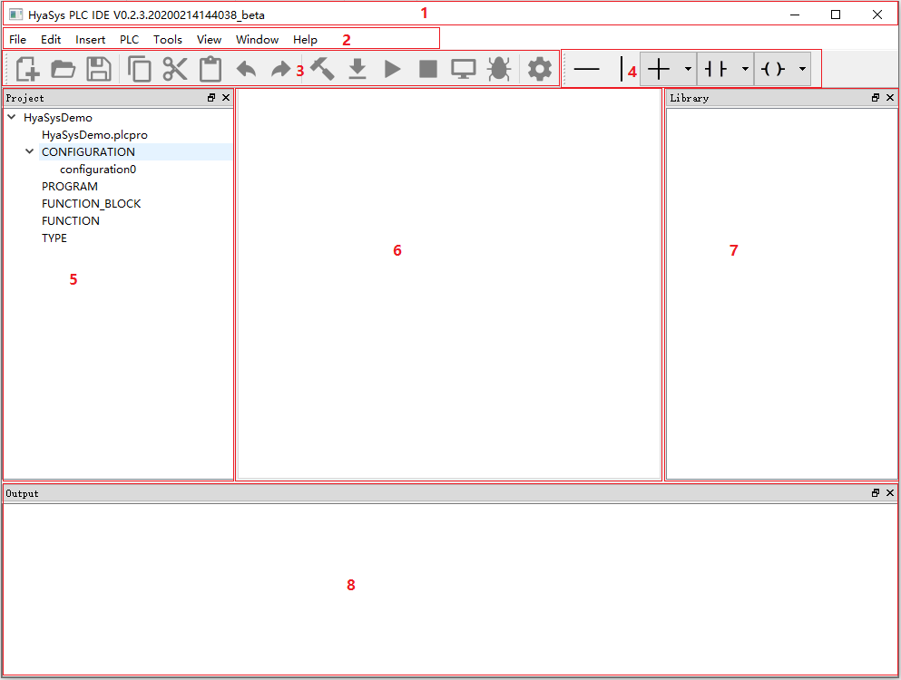
软件主界面
1 标题栏，2 主菜单， 3 主工具栏， 4 梯形图编辑工具栏，
5 项目管理窗体， 6 主窗体， 7 库管理窗体， 8 信息输出窗体

以下各节将分别介绍软件界面的各组成部分。

##4.1	标题栏

标题栏显示软件名称、版本号等信息。

##4.2	主菜单

主菜单包括文件、编辑、插入、PLC、工具、视图、窗体、帮助等菜单项。

###4.2.1 文件菜单

| 名称 | 快捷键 | 功能描述 |
| :-: | :-: | :-: |
|新建 | | 创建一个新项目 |
|打开 | | 打开硬盘上保存的项目文件 |
|保存 | Ctrl+S | 将当前项目保存到硬盘 |
|关闭 | | 关闭当前项目 |

###4.2.2 编辑菜单

| 名称 | 快捷键 | 功能描述 |
| :-: | :-: | :-: |
复制 | | 复制选中对象，比如一段文本、一个文件、一个POU等。
剪切 | | 剪切选中对象，比如一段文本、一个文件、一个POU等。
粘贴 | | 粘贴复制或剪切的对象，比如一段文本、一个文件、一个POU等。
撤消 | | 撤消当前操作
重做 | | 重做当前撤消的操作

###4.2.3 插入菜单
| 名称 | 快捷键 | 功能描述 |
| :-: | :-: | :-: |
 | | 
			
###4.2.4 PLC菜单

| 名称 | 快捷键 | 功能描述 |
| :-: | :-: | :-: |
生成PLC文件 | | 解析工程信息生成标准格式的PLC代码文本，保存为后缀为.plc的文件。
生成C文件 | | 解析工程信息生成C语言代码，保存为后缀为.c/.h的文件
创建 | | 将当前工程编译生成目标代码文件（社区版软件不支持）
清除 | | 清除生成的文件
下载 | | 下载目标代码至PLC（社区版软件不支持）
运行 | | 控制PLC开始运行控制功能（社区版软件不支持）
停止 | | 控制PLC停止运行控制功能（社区版软件不支持）
监控 | | 监控PLC运行状态与数据（社区版软件不支持）

###4.2.5 工具菜单

| 名称 | 快捷键 | 功能描述 |
| :-: | :-: | :-: |
选项 | | 打开选项配置对话框

###4.2.6 视图菜单

| 名称 | 快捷键 | 功能描述 |
| :-: | :-: | :-: |
工程可停靠窗体 | | 打开/关闭工程可停靠窗体
库可停靠窗体 | | 打开/关闭库可停靠窗体
输出可停靠窗体 | | 打开/关闭输出可停靠窗体

###4.2.7 窗体菜单
| 名称 | 快捷键 | 功能描述 |
| :-: | :-: | :-: |
 | | 
			
###4.2.8 帮助菜单

| 名称 | 快捷键 | 功能描述 |
| :-: | :-: | :-: |
帮助 | | 打开帮助文档
修订历史 | | 打开修订历史对话框
关于 | | 打开“关于”对话框

##4.3	工具栏
软件提供两个工具栏：主工具栏、梯形图编辑工具栏。
###4.3.1	主工具栏

主工具栏图标依次是：新建、打开、保存、复制、剪切、粘贴、撤消、重做、创建、下载、运行、停止、监控、调试、配置，分别对应主菜单相关功能，请查看4.2.1 ~ 4.2.8节表格。
###4.3.2	梯形图编辑工具栏

| 名称 | 快捷键 | 功能描述 |
| :-: | :-: | :-: |
水平连接 | | 向梯形图中插入水平连接线
竖直连接 | | 向梯形图中插入竖直连接线
交叉连接 | | 向梯形图中插入各种交叉连接线，通过下拉列表选择类型
触点 | | 向梯形图中插入各种触点，通过下拉列表选择类型
线圈 | | 向梯形图中插入各种线圈，通过下拉列表选择类型
功能调用（规划） | |向梯形图中插入各种功能调用，通过下拉列表选择类型
功能块实例调用（规划） | |向梯形图中插入功能块调用，通过下拉列表选择类型		

交叉连接有如下图所示类型：

触点有如下图所示类型：

线圈有如下图所示类型：

##4.4	项目管理窗体
项目管理窗体内部是一个树型结构，描述了项目的各组成部分，项目树的各叶子节点都可以点开进行相应编辑与操作。
 

##4.5	PLC库管理窗体
等待补充…

##4.6	主窗体
主窗体是一个多页面控件，集中管理显示各种主要功能页面：
- PLC配置管理页面
- PLC资源管理页面
- PLC程序组织单元（POU）管理页面

###4.6.1	PLC配置管理页面
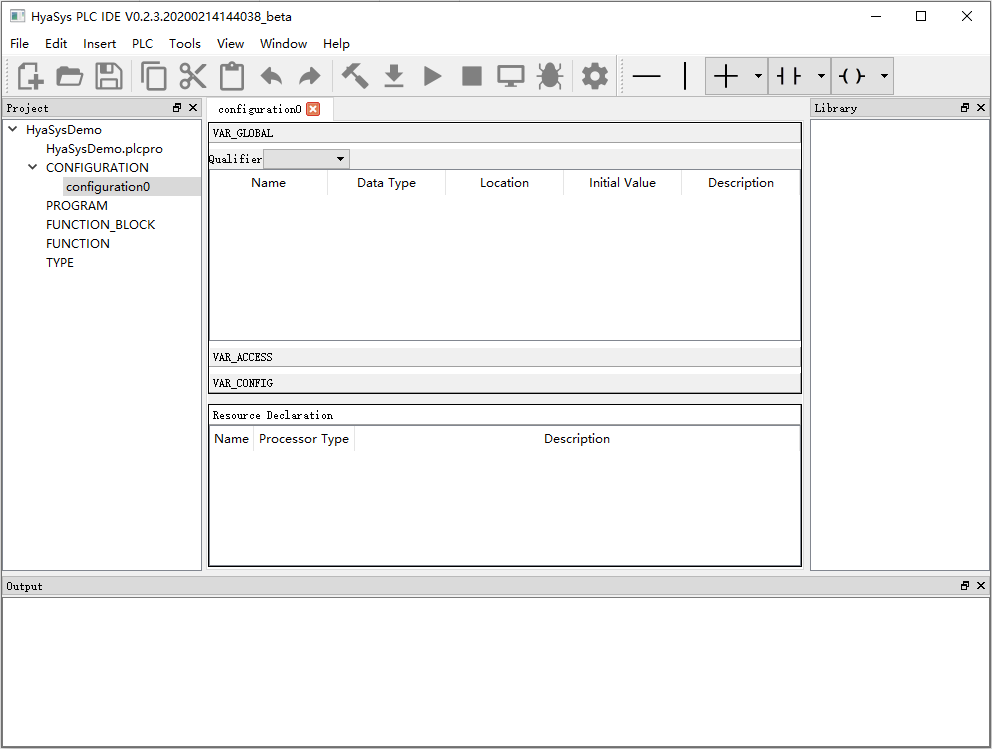 

###4.6.2	PLC资源管理页面
  

###4.6.3	PLC程序组织单元编辑页面
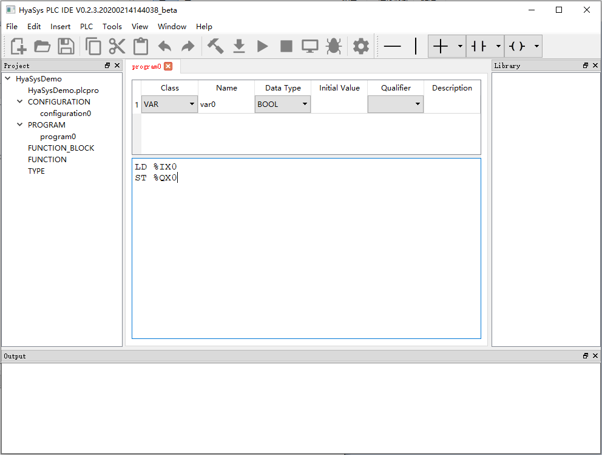 
 

##4.7	信息输出窗体
信息输出窗体显示各种必要的信息，供用户查看。
  

#5	软件操作
##5.1	工程管理
###5.1.1	新建工程
以下两种操作可新建工程：
- 主菜单->File->New
- 主工具栏->New 

###5.1.2	打开工程
以下两种操作可打开工程：
- 主菜单->File->Open
- 主工具栏->Open

###5.1.3	保存工程
以下两种操作可保存工程：
- 主菜单->File->Save
- 主工具栏->Save

###5.1.4	关闭工程
关闭工程操作：
主菜单->File->Close

##5.2	组态与编程
###5.2.1	修改PLC配置
双击工程树的配置叶子节点，可打开PLC配置管理页面。在本页面可以添加、删除和编辑从属于配置的全局变量、存取路径、实例专用的初始化、资源。

####5.2.1.1	添加删除全局变量
在VAR_GLOBAL表中右键点击，弹出右键菜单，选择“Insert”，即可插入一个全局变量。添加完成后可设置全局变量的名称、数据类型、位置、初始值、描述信息等。 
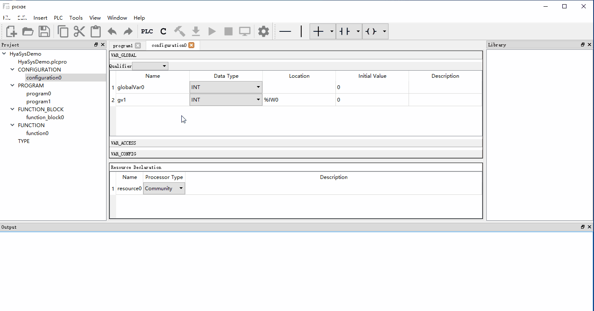
在右键菜单中选择“Remove”可以删除选定的全局变量。

####5.2.1.2	添加删除存取路径说明
等待补充…

####5.2.1.3	添加删除实例专用初始化说明
等待补充…

####5.2.1.4	添加删除资源说明
在资源说明表中右键点击，弹出右键菜单，选择“Insert”，即可插入一个资源说明。添加完成后可设置资源名称、处理器类型、描述信息。双击行可打开资源管理页面进行各种详细的设置。 
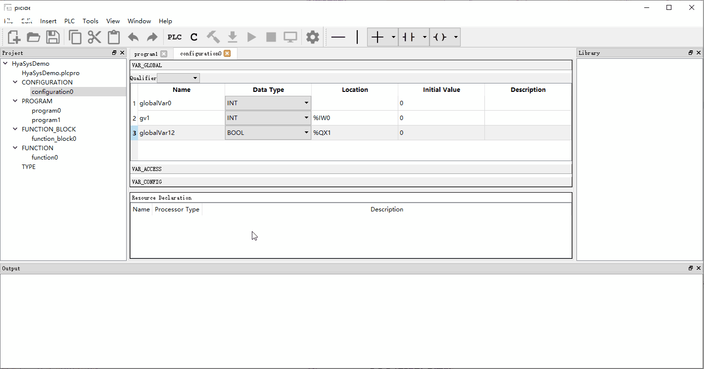
在右键菜单中选择“Remove”可以删除选定的资源说明。

###5.2.2	修改PLC资源
点击配置管理页面中资源说明表格中的行，则打开对应的资源管理页面。在本页面可以添加、删除和编辑从属于资源的全局变量、任务和程序实例。
####5.2.2.1	添加删除全局变量
在全局变量表中右键点击，弹出右键菜单，选择“Insert”，即可插入一个全局变量。添加完成后可设置全局变量的名称、数据类型、位置、初始值、描述信息等。
在右键菜单中选择“Remove”可以删除选定的全局变量。
在资源中添加与删除全局变量都和在配置中的操作一样。

####5.2.2.2	添加删除任务
在任务表中右键点击，弹出右键菜单，选择“Insert”，即可插入一个任务。添加完成后可设置任务的名称、触发模式（信号跳变触发、周期触发）、触发时间、优先级、描述信息。
在右键菜单中选择“Remove”可以删除选定的任务。 
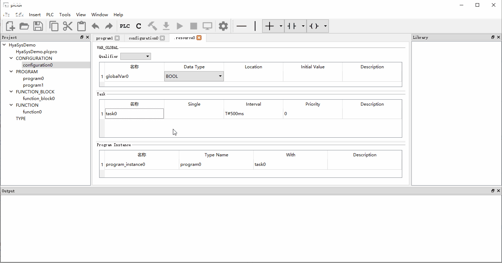

####5.2.2.3	添加删除程序实例
在程序实例中右键点击，弹出右键菜单，选择“Insert”，即可插入一个程序实例。添加完成后可设置程序实例的名称、程序名称、关联的任务名称、描述信息。
在右键菜单中选择“Remove”可以删除选定的程序实例。
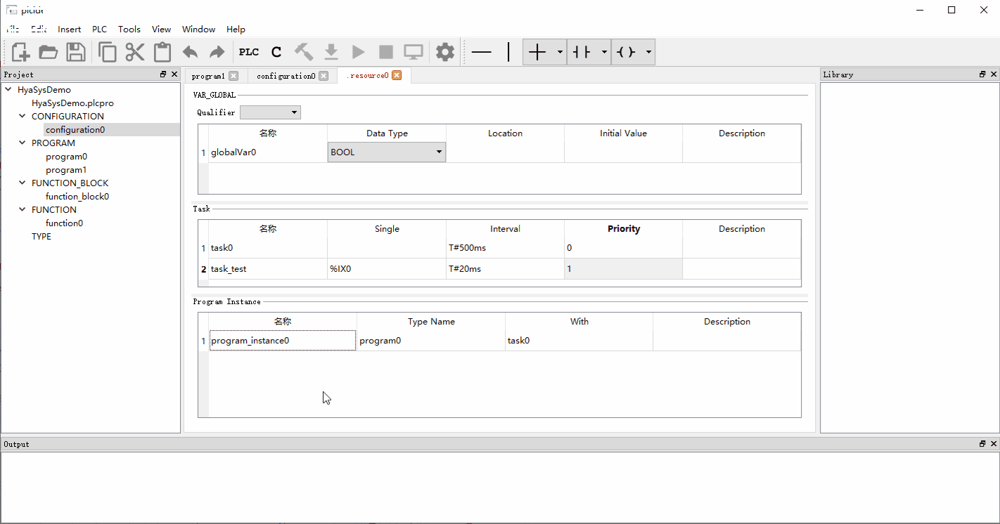 

###5.2.3	新建程序组织单元 
####5.2.3.1	新建功能
在工程树的FUNCTION标签上右键点击，弹出右键菜单，选择”Insert Function”可弹出新建功能对话框。在本对话框中可设置新建功能的名称、输出数据类型、使用的编程语言。

####5.2.3.2	新建功能块
在工程树的FUNCTION BLOCK标签上右键点击，弹出右键菜单，选择”Insert Function Block”可弹出新建功能块对话框。在本对话框中可设置新建功能的名称、使用的编程语言。
 

####5.2.3.3	新建程序
在工程树的PROGRAM标签上右键点击，弹出右键菜单，选择”Insert Program”可弹出新建程序对话框。在本对话框中可设置新建功能的名称、使用的编程语言。
 

###5.2.4	编辑程序组织单元
新建程序组织单元，或者点击项目树的任一程序组织单元叶子节点，则进入程序组织单元管理页面，可以添加、删除和修改程序参数、变量，编辑程序逻辑。程序逻辑可以使用文本语言或者图形语言。

####5.2.4.1	添加删除参数
在参数表中右键点击，弹出右键菜单，选择“Insert”，即可插入一个参数。添加完成后可设置参数的类型、名称、数据类型、初始值、属性、描述信息等。
在右键菜单中选择“Remove”可以删除选定的参数。
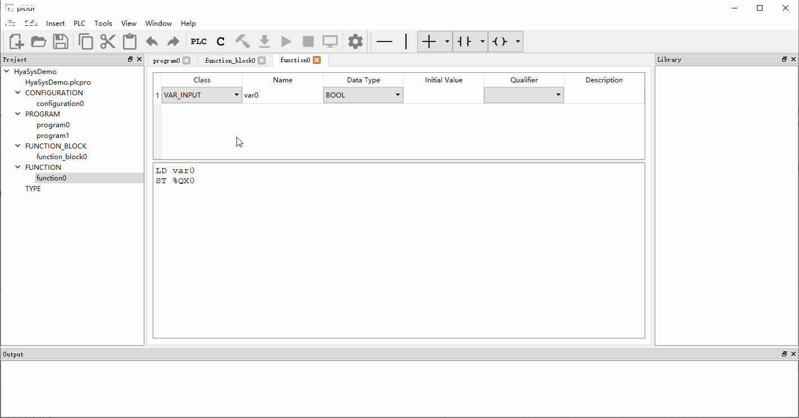

####5.2.4.2	文本语言程序编辑
目前文本语言编辑器只能进行基本的文本输入，没有附加特殊功能。用户需要自己按照编程参考描述的语法规则输入文本，完成程序编辑。
后续会加入语法着色、自动补全、错误检查等高级功能。

####5.2.4.3	梯形图语言程序编辑
梯形图程序呈现在一张画布上，画面左右是两条电源轨线，中间由行列排布的大小相同的矩形图元组成，梯形图程序的基本规则是使信号由左电源轨线传输至右电源轨线，形成一条或多条通路。如下图所示：
 
如果一个元件的大小超出了一个图元的范围，则它将占用多个图元，比如功能与功能块实例调用。

目前支持两种模式编辑梯形图程序。
- 通过工具栏编辑
选中一个图元，然后点击梯形图工具栏上的连线或元件图标，即可将选中的元件放置在图元位置，如下面的动图所示：

梯形图编辑工具栏的说明参见“梯形图编辑工具栏”一节。

- 通过右键菜单编辑
选中一个图元，右键调出菜单，选择需要的连线或元件，就能将选中的对象放置到图元上。如下面的动图所示：
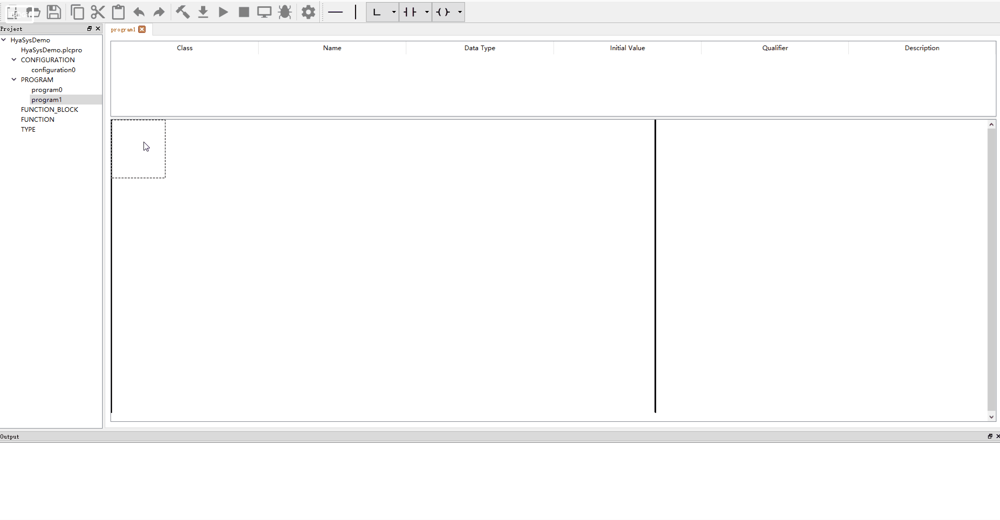
梯形图编辑右键菜单如下图所示： 
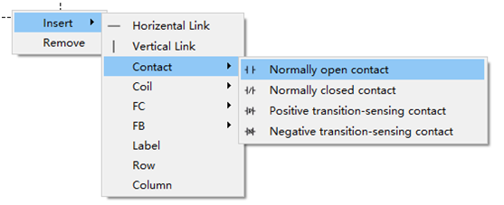
从右键菜单中可选择插入：
- 水平连接线
- 竖直连接线
- 交叉连接线（规划）
- 触点
- 线圈
- 功能
- 功能块实例
- 标签
- 行：在选定图元下方插入一行空白图元，用于扩展画布范围。
- 列：在选定图元的右方插入一列空白图元，用于扩展画布范围。

从右键菜单选择“Remove”， 可移除当前选中的图元。
插入元件后，单击元件的参数域，可以修改参数。例如：
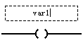

##5.3 代码生成
根据不同的需求，可以选择输出不同的代码文件：
- 标准PLC代码文件，用于与同样符合标准的其它编程环境进行交流；
- C代码文件，用于外部单片机控制程序开发；
- 目标代码文件，直接下载至目标PLC中执行（社区版不支持）；

###5.3.1 生成PLC代码
选择“主菜单”=>“PLC”=>“生成PLC代码”，即可生成PLC代码，并输出到以工程名命名，后缀为”.plc”的文件中。

###5.3.2 生成C代码
选择“主菜单”=>“PLC”=>“生成C代码”，即可生成C语言代码(*.c/*.h)，并输出到工程目录下名称为”plctoc_output”的子目录中。

###5.3.3 构建目标代码（社区版软件不支持）
选择“主菜单”=>“PLC”=>“Build”，即可直接构建目标代码，生成以下文件：
- 工程名.bin——二进制文件
- 工程名.elf

##5.4	PLC联机操作（社区版软件不支持）

###5.4.1	程序下载
等待补充…

###5.4.2	PLC运行/停止控制
等待补充…

###5.4.3	PLC运行时监控
等待补充…

###5.4.4	PLC程序调试
等待补充…

###5.5	软件选项设置
以下操作可以弹出选项设置对话框：
- 主菜单->Tools->Options…
- 主工具栏->Options… 

通过选项设置对话框可设置软件的各种配置选项，包括语言设置、通信接口设置及连接等。

#6	编程参考
参见文档《IEC61131-3标准PLC编程参考手册》

#7	库
##7.1	标准库
等待补充…

##7.2	扩展库
等待补充…

##7.3	用户库
等待补充…
